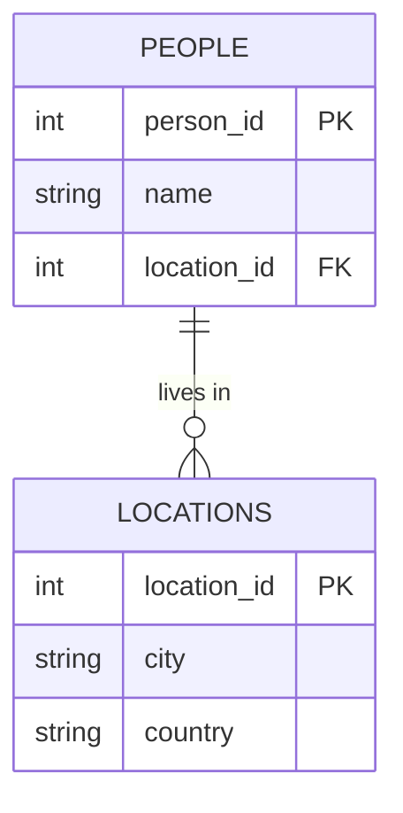
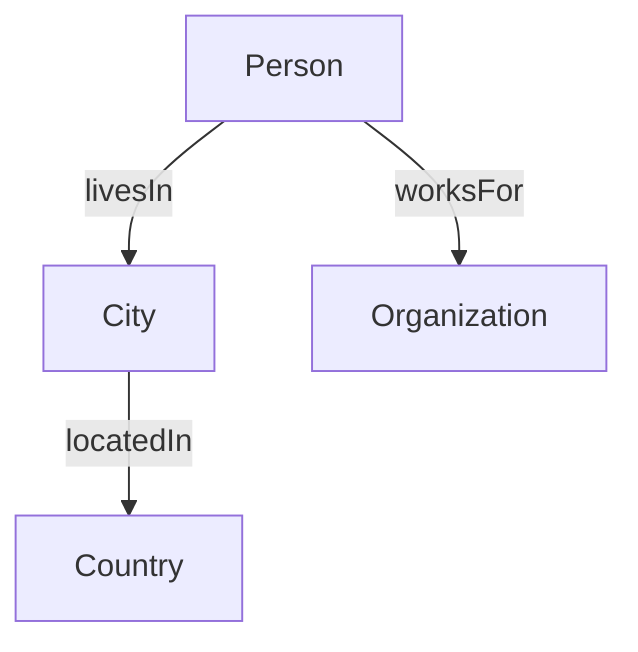
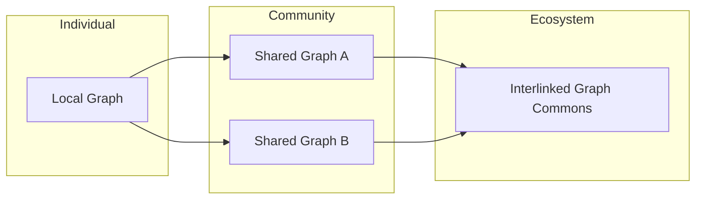
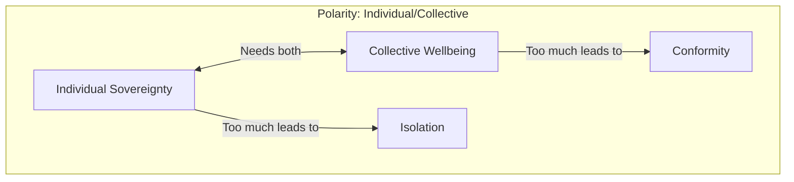

# From Separation to Connection — Rethinking Data in a Relational Age

We are living through a civilizational shift — from a culture of **separation** to one of **relationship**.

Modern society, for centuries, has been shaped by an ethos of individualism, objectivity, and separation. This worldview has brought technological progress, but also deep crises:

- **Ecological crisis** — disconnection from the natural world
- **Social crisis** — breakdown of community and shared values
- **Psychological crisis** — fragmentation of the self and loss of meaning
- **Epistemological crisis** — polarization of truth and erosion of shared reality

If we are to heal these crises, we must reconnect — with the Earth, with each other, and within ourselves. We must shift toward a worldview of **relationality**, **integration**, and **systems thinking**, where we understand not just _things_, but the **relationships between things**.

## Data Reflects Culture

This cultural separation has also shaped how we manage knowledge.

Our dominant data systems — **tabular databases**, **spreadsheets**, **data silos** — reflect a worldview of fragmentation. They prioritize **discrete entities**, stripped of context and connection. Even when data is aggregated, it's often locked away in centralized warehouses — raising concerns around sovereignty, transparency, and collective well-being.

### 📊 Siloed Tabular Data (Traditional Relational DB)

Relational databases typically separate entities into distinct tables. Relationships require manual stitching via foreign keys and JOINs.

 
<strong>Reading the diagram</strong> (click to expand)
 In this Entity-Relationship (ER) diagram, `||--o{` represents a one-to-many relationship where one person can live in many locations. The fields marked `PK` are Primary Keys (unique identifiers), while `FK` indicates Foreign Keys that reference other tables. This notation is common in database design to show table structures and their relationships. 

This structure works, but it treats relationships as secondary — something inferred at query time, not natively represented.

## From Tables to Graphs

In contrast, **linked data**, **knowledge graphs**, and **semantic web technologies** embody a relational paradigm. These systems are designed to represent **connections**, **meanings**, and **context**. They reflect the idea that knowledge is not just stored, but _interwoven_ — a living system, not a static archive.

### 🔗 Graph-Based Knowledge Representation

In a graph-native model, relationships are first-class citizens. Traversing relationships is natural, intuitive, and performant.

This matches how we _think_ — through context, connection, and meaning.

## But Can't Tables Do Everything Graphs Can?

A fair challenge often arises:

> "Aren't relational databases Turing complete? Can't you model everything in them, including graphs?"

**Technically, yes.** You can simulate graphs using relational databases — by modeling nodes and edges in tables, using JOINs to traverse relationships.

But **technically possible** is not the same as **culturally expressive**.

Graph-native systems do more than enable graph structures — they _prioritize relationships_ as first-class citizens:

|Aspect|Relational DBs|Graph DBs / Linked Data|
|---|---|---|
|Mental model|Tables and rows|Nodes and edges|
|Default emphasis|Entities and attributes|Connections and patterns|
|Common use cases|Transactional data|Semantic, interconnected data|
|Interoperability|Schema-specific|Ontologies, RDF, URIs|
|Data ownership|Centralized|Distributed, linked|
|Query language|SQL (joins)|SPARQL, Cypher, Gremlin|

Using tables to simulate a graph is like drawing curves with straight lines. It's _possible_ — but not intuitive, expressive, or optimized for the task.

More importantly, it doesn't shift the **mental model** that guides how we think about data and knowledge.

## 🌐 Fractal / Holarchic Knowledge Sharing

Linked data also opens up **new architectures of knowledge sharing** — where individuals can own and link their data locally, and share into larger collectives.

This enables **fractal, holarchic knowledge ecosystems** — where meaning emerges from the ground up, not the top down.

## The Indigenous Wisdom of Relational Knowledge

The shift toward relational knowledge systems isn't entirely new. Many indigenous cultures have maintained relational knowledge practices for millennia. Their ways of knowing emphasize:

- **Context over isolation** — understanding phenomena within their web of relationships
- **Cyclical over linear** — seeing patterns that repeat and evolve over time
- **Participatory over objective** — recognizing the knower as part of the known
- **Multi-generational over short-term** — holding knowledge across time horizons of centuries

Consider how many indigenous languages are verb-based rather than noun-based, emphasizing processes and relationships rather than static objects. The Navajo language, for instance, centers on verbs and motion, seeing the world as dynamic patterns of energy rather than fixed entities.

Modern knowledge graphs can learn from these ancient wisdom traditions, integrating their insights into contemporary digital systems.

## Beyond Binary: Polarity Thinking in Knowledge Systems

Our current information architecture often reinforces binary thinking—true/false, either/or, with us/against us. This contributes to polarization and reductionism in public discourse.

Relational knowledge systems can transcend these limitations through:

**Polarity mapping** — representing complementary values as poles to be integrated rather than opposites to choose between:

**Multi-valued logic** — moving beyond binary true/false to represent:

- Degrees of certainty
- Multiple perspectives
- Contextual validity
- Unknown or incomplete information

**Dynamic context representation** — showing how knowledge and meaning shift across different:

- Cultural contexts
- Disciplinary frameworks
- Historical periods
- Scales of analysis

## Embodied Knowledge: Beyond the Mental Realm

The relationality revolution isn't just about abstract data structures—it's also about recognizing embodied, tacit, and experiential forms of knowing.

Future knowledge systems need to integrate:

**Somatic intelligence** — how we know through our bodies

**Emotional wisdom** — affective dimensions of understanding

**Intuitive patterns** — recognition that precedes conscious articulation

**Collective intelligence** — wisdom that emerges between people, not just within them

Graph-based knowledge systems are uniquely positioned to integrate these dimensions by:

1. **Mapping embodied practices** to conceptual frameworks
2. **Linking experiential data** with analytical models
3. **Representing tacit knowledge** through patterns of relationship
4. **Connecting diverse ways of knowing** without reducing one to another

## The Quantum Turn in Knowledge Management

The shift from classical to quantum physics offers a powerful metaphor for the evolution of our knowledge systems:

|Classical Data|Quantum-Inspired Knowledge|
|---|---|
|Fixed states|Superposition of possibilities|
|Discrete entities|Entangled relationships|
|Observer-independent|Observer-participatory|
|Deterministic|Probabilistic|
|Locality|Non-locality|

Like quantum systems, modern knowledge networks can represent:

- **Entanglement** — when knowledge in one domain is inextricably linked to another
- **Complementarity** — when multiple contradictory models are simultaneously valid
- **Emergence** — when the whole exhibits properties not predictable from the parts
- **Observer effects** — when the act of observation changes what is observed

## Practical Applications: Where Relationship-Centric Data Shines

This relational turn isn't just philosophical—it's already transforming practical domains:

**Healthcare**

- Moving from symptom-based to systems-based approaches
- Mapping complex interactions between genetics, environment, and lifestyle
- Connecting mental, physical, social, and environmental determinants of health

**Environmental Stewardship**

- Modeling complex ecosystems and their interdependencies
- Tracking cascading effects of interventions across systems
- Integrating indigenous ecological knowledge with scientific data (e.g., within a [[BioregionalKnowledgeCommons|Bioregional Knowledge Commons]])

**Governance**

- Creating transparently linked policy networks
- Enabling participatory sensemaking across stakeholder groups using [[DiscourseGraphs]]
- Tracking distributed impacts of decisions
- Developing [Open Protocols](/OpenProtocols) for civic coordination

**Science and Research**

- Transforming scientific collaboration through [DeSci](/GraphsForDeSci)
- Creating knowledge commons that connect researchers globally
- Linking research to practical implementation
- Supporting evidence-based policy and decision-making

**Local Manufacturing and Production**

- Enabling [cosmo-local](/cosmolocalism) production systems where "what is heavy is local, what is light is global"
- Supporting distributed manufacturing with globally shared designs
- Creating resilient local supply chains informed by global knowledge commons
- Reducing environmental footprint while maintaining technological advancement

**Education**

- Mapping knowledge domains and their interconnections
- Personalizing learning paths while maintaining coherence
- Integrating multiple disciplines around complex challenges

## The Ethics of Relational Data: From Extraction to Reciprocity

The shift to relationship-centric systems requires corresponding ethical frameworks:

**From data extraction to data reciprocity**

- Ensuring value flows back to data contributors
- Recognizing collective rights over shared knowledge
- Creating protocols for ethical data sharing and linkage

**From ownership to stewardship**

- Reframing data as a commons to be tended, not a resource to be owned
- Developing governance models that balance individual and collective rights
- Creating timebound, conditional access patterns rather than permanent transfers

**From algorithmic opacity to transparent relationality**

- Making the logic of algorithms visible and contestable
- Enabling communities to set values and boundaries for automated systems
- Ensuring human judgment remains central in consequential decisions

## Tools for the Transition

The theory is compelling, but what tools exist today to begin this transition?

**Personal Knowledge Graphs**

- Tools like [Logseq](https://logseq.com/), [Roam Research](https://roamresearch.com/), and [Obsidian](https://obsidian.md/) bring graph-based thinking to personal knowledge management
- Emphasis on bidirectional linking and emergent structure
- Growing ecosystems for sharing and connecting personal knowledge

**Linked Data Standards**

- [RDF](https://www.w3.org/RDF/) (Resource Description Framework)
- [JSON-LD](https://json-ld.org/) for web-friendly linked data
- [Schema.org](https://schema.org/) for common vocabularies

**Graph Databases**

- [Neo4j](https://neo4j.com/) for property graphs
- [Stardog](https://www.stardog.com/) for semantic knowledge graphs
- [TerminusDB](https://terminusdb.com/) for versioned graph data

**Decentralized Web Technologies**

- [Solid](https://solidproject.org/) for personal data pods
- [IPFS](https://ipfs.io/) for distributed content addressing
- [Ceramic](https://ceramic.network/) for decentralized data streams

**Collective Intelligence Platforms**

- [Kialo](https://www.kialo.com/) for structured deliberation
- [Pol.is](https://pol.is/) for mapping opinion landscapes
- [Remesh](https://remesh.ai/) for scalable dialogue

## Beyond Information Architecture: Cultivating Relational Consciousness

Ultimately, the most profound shift isn't technological but psychological and cultural. We need to cultivate what philosopher Charles Eisenstein calls "relational consciousness" — an awareness of our embeddedness in webs of connection.

This cultivation happens at multiple levels:

**Individual practices**

- Systems thinking and pattern recognition skills
- Contemplative practices that reveal interconnection
- Immersion in natural systems and their intricate relationships

**Organizational structures**

- Moving from hierarchies to networks and holarchies
- Developing decision-making processes that integrate diverse perspectives
- Creating information environments that make relationships visible

**Cultural narratives**

- Shifting from stories of separation to stories of interbeing
- Reframing success from individual achievement to collective flourishing
- Extending timeframes from quarterly profits to seven-generation thinking

## Reweaving the Web of Meaning

To meet the crises of our time — ecological, social, psychological, epistemological — we need tools that help us **see relationships**, **trace patterns**, and **co-create meaning**.

That means:

- Moving from **siloed** to **linked** data
    
- Embracing [Open Protocols](/OpenProtocols) for semantic interoperability
    
- Designing systems that are **local-first**, **user-owned**, and **collaboratively governed**
    
- Building **living knowledge commons** where individuals and communities co-steward meaning through approaches like [Discourse Graphs](/DiscourseGraphs)
    
- Integrating **diverse ways of knowing** — analytical, somatic, intuitive, indigenous
    

This is more than a technical upgrade. It is a **civilizational reorientation** — from extraction to regeneration, from isolation to integration, from fragmentation to wholeness.

We don't just need better databases.  
We need **better ways of knowing** — and **being**.

The relational turn in our data systems is both a reflection of and catalyst for this deeper transformation. As we learn to see, map, and tend to relationships in our digital systems, we also cultivate the capacity to perceive and nurture them in ourselves, our communities, and our planet.

In the words of physicist and systems thinker Fritjof Capra: "The more we study the major problems of our time, the more we come to realize that they cannot be understood in isolation. They are systemic problems, which means that they are interconnected and interdependent."

Our knowledge systems must evolve to reflect this fundamental insight. Promising approaches like [Discourse Graphs](/DiscourseGraphs) for civic knowledge commons, [Open Protocols](/OpenProtocols) for coordination, and [Decentralized Science](/GraphsForDeSci) all point toward a more relational, integrated future. Combined with material practices like [[cosmolocalism]] that balance global knowledge sharing with local production, these approaches are creating the foundations for a truly regenerative civilization.

The good news is that this transformation is already underway.
